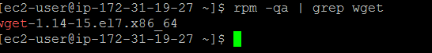
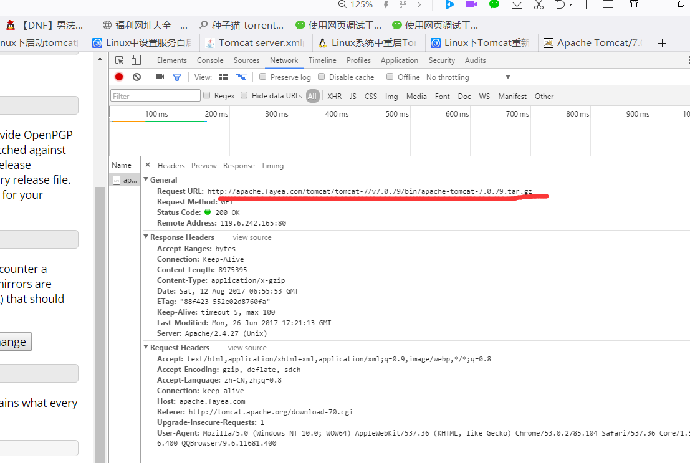
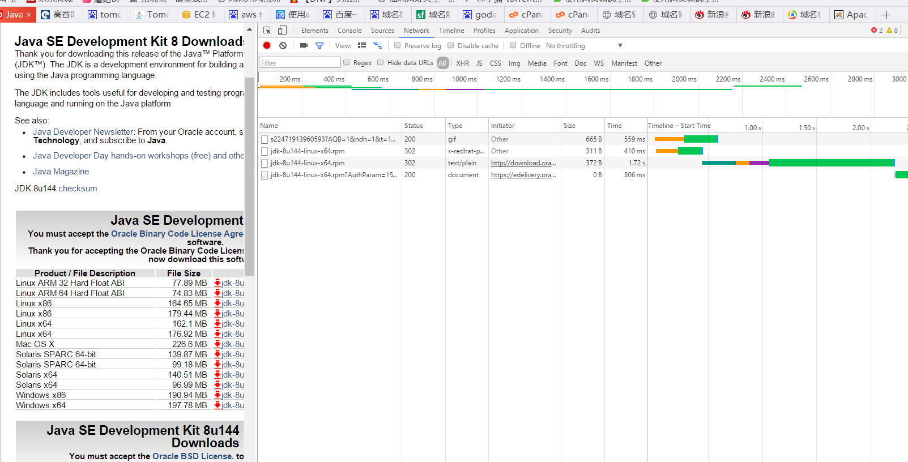

Tomcat 在AWS中遇到的坑
1.因为我的网络极慢，通过官网上介绍的使用winSCP去传文件到Linux中是太慢了，所以决定使用Wget来下载
直接去使用
我使用的Red hat ,这个版本的linux 和centos和 fedora发行版本比较像
1，如果没有不能用wget 请先下载
``sudo yum install wget``  //因为yum 需要高级一点的权限
当然也可以先查询下有没有装wget

`wget http://apache.fayea.com/tomcat/tomcat-7/v7.0.79/bin/apache-tomcat-7.0.79.tar.gz`

 
不过可以通过浏览器自带的工具去查看完全的地址，上面就是获取的完整且正确的路径。
同理也可以以这样的方式来下载jdk 

``wget http://download.oracle.com/otn-pub/java/jdk/8u144-b01/090f390dda5b47b9b721c7dfaa008135/jdk-8u144-linux-x64.rpm?AuthParam=1502521858_ac609ff3da35b2c7212ef5e8bd14e298``

 
上一串的url的Authparam的值每一次都会变，所以要下载时请点开浏览器F12去查看准确的地址

